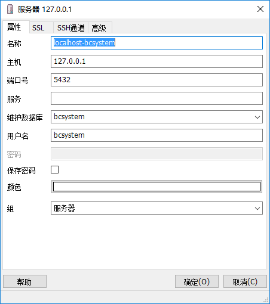
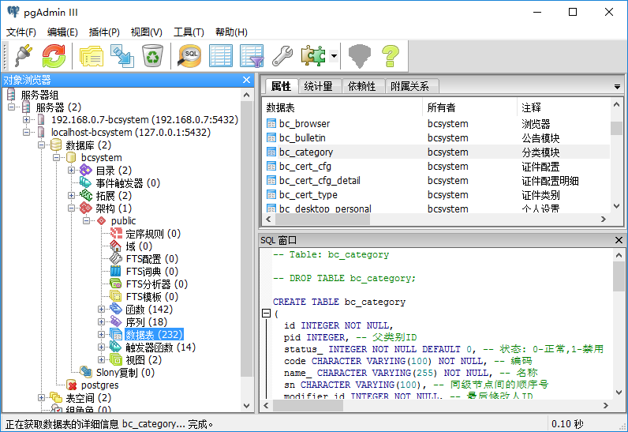
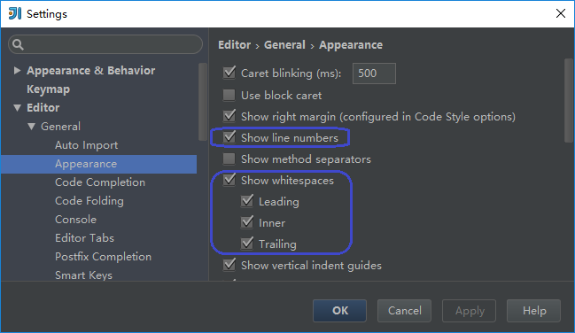
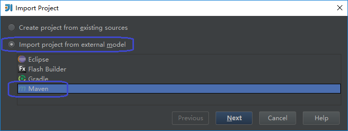
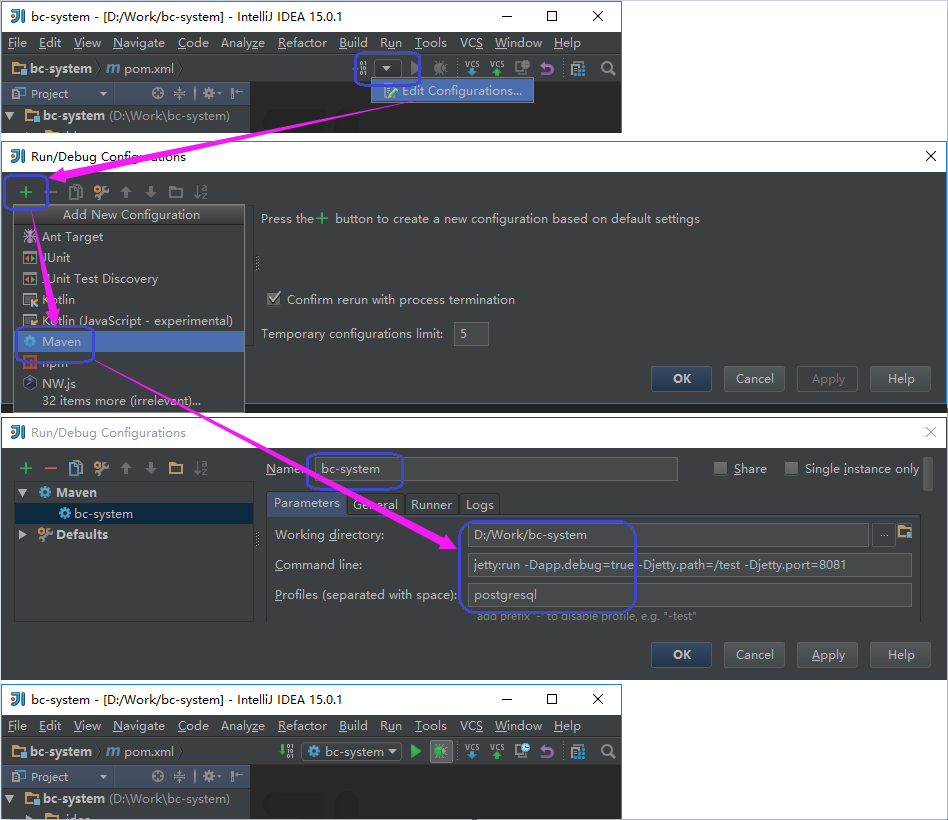
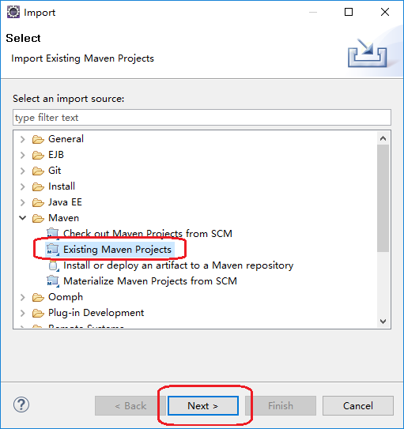
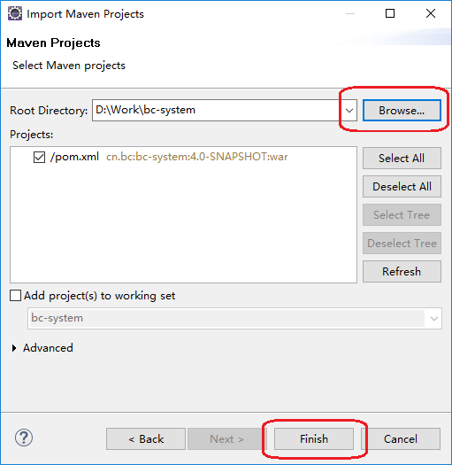

# BC 系统开发环境配置

## 一）安装 JDK

- 下载绿色版的 JDK8<br>
用 ftp 工具连接到 192.168.0.222（账号reader、密码reader），
文件路径为 /file/tools/java/jdk/green/jdk1.8.0_102_x64.7z  
注：也可以到[官网](http://www.oracle.com/technetwork/java/javase/downloads/index.html)下载安装。
- 将 jdk1.8.0_102_x64.7z 解压到 /your/path/to/jdk (推荐为 /green/jdk)，确认解压后的目录结构如下：
```
/your/path/to/jdk/jdk1.8.0_102_x64/bin
                                  /jre
                                  /lib
                                  /...
```
- 配置环境变量
```
JAVA_HOME = /your/path/to/jdk/jdk1.8.0_102_x64
PATH 添加 %JAVA_HOME%/bin (Windows)、$JAVA_HOME/bin (Linux、MacOS)
```
- 验证安装是否正确
```
$ java -version
```

## 二）安装 Maven

- 到 [Maven 官网](http://maven.apache.org/) 下载最新版的 maven 二进制包，如 [apache-maven-3.3.9-bin.tar.gz](http://apache.fayea.com/maven/maven-3/3.3.9/binaries/apache-maven-3.3.9-bin.tar.gz)。

- 将 apache-maven-3.3.9-bin.tar.gz 解压到 /your/path/to/maven (推荐为 /green/maven)，确认解压后的目录结构为如下：
```
/your/path/to/maven/apache-maven-3.3.9/bin
                                      /boot
                                      /conf
                                      /lib
                                      /...
```

- 配置环境变量
```
M2_HOME = /your/path/to/maven/apache-maven-3.3.9
PATH 添加 %M2_HOME%/bin (Windows)、$M2_HOME/bin (Linux、MacOS)
```

- 增加 Maven 用户配置文件  
在用户目录下创建 .m2 目录：
```
Windows:
> C:
> cd %USERPROFILE%
> md .m2

Linux、MacOS:
$ cd ~
$ mkdir .m2
```
拷贝这里的 [settings.xml](https://github.com/bcsoft/bc-start/blob/master/settings.xml) 文件到 .m2 目录下。并将文件内的 localRepository 节点的值修改为有效的路径，Windows 下推荐为 'D:/Repositories/MavenRepository'。

- 验证安装是否正确
```
> mvn -v
```

- 参考资料  
[Maven开发环境配置](http://rongjih.blog.163.com/blog/static/33574461201041615854740/)  
[官方参考文档](http://maven.apache.org/guides/index.html)  
[Maven权威指南](http://books.sonatype.com/mvnref-book/reference/index.html)  
《Maven权威指南中文版》可到 `192.168.0.222 /file/book/Maven权威指南(中文带目录导航).pdf` 下载。

## 三）安装 Git 
- [官网下载](http://git-scm.com/downloads) 或 `192.168.0.222 /file/tools/win/git/Git-2.9.0-64-bit.exe (Windows)` 下载安装。  
注：安装到 "Select Components" 界面时，注意要选择如下安装选项:
  - [x] Windows Explorer integration
    - [x] Git Bash Here
    - [x] Git GUI Here  


- 验证安装是否正确  
在资源管理器空白的地方点击鼠标右键，能够看到 Git Bash Here 和 Git GUI Here 两个菜单项就证明安装OK，点击 Git Bash Here 菜单项就可进入 Git 命令行，如下图所示：  
  


- 参考资料  
[首先基于互联网的Git开发环境搭建(Windows系统)](http://rongjih.blog.163.com/blog/static/33574461201101504819691/)  
[Git常用操作命令](http://rongjih.blog.163.com/blog/static/335744612010112562833316/)

## 四）配置 ssh key
如果已经有相应的密钥对，可以直接将私钥放到 `%USERPROFILE%/.ssh (Windows) 或 ~/.ssh (Linux、 MacOS)` 目录下即可。如果还没有密钥对就按如下步骤创建：

- 打开 Git 的命令行窗口，输入`$ ssh-keygen -C "your@email.com" -t rsa`，按提示输入相关信息生成 rsa key（注意email地址按你的实际输入）；默认就会在用户目录下创建名为“.ssh”的目录，并在该目录下生成两个文件：`id_rsa.pub (公钥)` 和 `id_rsa (私钥)`。

- 如果想修改上面创建的密钥的密码，执行命令 `$ ssh-keygen -f '/c/Documents and Settings/yourName/.ssh/id_rsa' -p`，根据提示输入原来的密码和设置新的密码即可。

## 五）[可选] 安装 TortoiseGit (Windows)
[官网下载](https://tortoisegit.org) 或 `192.168.0.222 /file/tools/win/git/TortoiseGit-2.2.0.0-64bit.msi` 下载安装。  
汉化：`192.168.0.222 /file/tools/win/git/TortoiseGit-LanguagePack-2.2.0.0-64bit-zh_CN.msi`  
安装成功后会在资源管理器的鼠标右键菜单中看到相应的选项，如下图所示：  


## 六）安装数据库
系统使用 PostgreSQL 9.5+ 数据库（推荐安装官方绿色版），下载安装后，创建名为 bcsystem 的开发数据库（拥有者的账号密码也同时设置为 bcsystem），
创建成功后，向管理员索要开发环境使用的数据库备份文件，将其导入到刚创建的 bcsystem 数据库中即可。  
以下为 Windows 的安装、初始化范例：

- 下载安装绿色版 PostgreSQL  
[官网下载](http://www.postgresql.org/download) 或 `192.168.0.222 /file/tools/win/postgresql/9.5/postgresql-9.5.3-1-windows-x64-binaries.zip` 下载、解压到 /your/path/to/postgresql/ (推荐为 D:\green\pgsql)，确认解压后的目录结构如下：
```
/your/path/to/postgresql/bin
                        /lib
                        /share
                        /...
```
- 将 /your/path/to/postgresql/bin 添加到环境变量 Path 内
- 创建数据目录  
\> md /your/path/to/postgresql/data
- 执行命令初始化数据库  
\> initdb -D "/your/path/to/postgresql/data"
- 命令行启动数据库  
\> postgres -D "/your/path/to/postgresql/data"
- 登录数据库管理端  
数据库启动成功后，命令行输入 `psql -dpostgres` 登录数据库管理端，如下图所示：  
  
- 创建登录密码为 bcsystem 的 bcsystem 账号  
postgres=# create role bcsystem login password 'bcsystem';  
- 创建 owner 为 bcsystem 的 bcsystem 数据库  
postgres=# create database bcsystem with encoding 'UTF-8' owner bcsystem;  
- 退出 postgres 的登录
postgres=# \q;  
- 命令行导入开发环境数据库  
\> psql -dbcsystem -Ubcsystem < xxx.sql  
注：xxx.sql 文件需向管理员索取。
- 使用 pgAdmin III 客户端连接数据库  
运行 /your/path/to/postgresql/bin/pgAdmin3.exe，添加数据库连接，如下图所示：  
  
  

- 参考资料：  
[官方网站](http://www.postgresql.org)  
[PostgreSQL 脚本收集](http://rongjih.blog.163.com/blog/static/33574461201110300454392/)

## 七）检出 bc-system 系统
BC 系统的代码统一放在 https://bitbucket.org/bctaxi 上，请将你的 bitbucket 账号告知管理员，让其分配好项目的相关权限后再执行下面的相关操作。

- 检出 bc-system
```
$ cd /d/Work/
$ git clone -o bitbucket git@bitbucket.org:bctaxi/bc-system.git
```

- 检出 bc-system/src/main/webapp/bc-business
```
$ cd /d/Work/bc-system/src/main/webapp/
$ git clone -o bitbucket git@bitbucket.org:bctaxi/bc-business-webapp.git bc-business
```

- 检出 bc-system/src/main/webapp/bc
```
$ cd /d/Work/bc-system/src/main/webapp/
$ git clone -o github git@github.com:bcsoft/bc-framework-webapp.git bc
```

- 检出 bc-system/src/main/webapp/bc-test
```
$ cd /d/Work/bc-system/src/main/webapp/
$ git clone -o github git@github.com:bcsoft/bc-test-webapp.git
```

- 检出 bc-system/src/main/webapp/ui-libs
```
$ cd /d/Work/bc-system/src/main/webapp/
$ git clone -o github git@github.com:bcsoft/ui-libs.git
$ git clone -o github git@github.com:bcsoft/ui-libs-demo.git
```

- 在命令行下运行 BC 系统
```
> D:
> cd D:/Work/bc-system/
> mvn jetty:run -Ppostgresql -Dapp.debug=true -Djetty.path=/test -Djetty.port=8081
```
系统成功启动后访问地址为：[http://localhost:8081/test](http://localhost:8081/test) 

## 八）安装 IntelliJ Idea 开发环境
按如下步骤安装配置 IntelliJ Idea：

- 安装 IntelliJ Idea 2016+  
[官网下载](http://www.jetbrains.com/idea/) 或 `192.168.0.222 /file/tools/java/idea/ideaIU-2016.2.exe` 下载安装。

- 项目编码设置  
导航至 File/Other Settings/Default Settings...->File encoding，  
将 IDE Encoding 和 Project Encoding 设置为 UTF-8。

- 属性文件中文转码设置  
File/Other Settings/Default Settings...->File encoding，  
选中 Transparent native-to-ascii conversion，参考下图：  
  
设置后，默认情况下 IDEA 将属性文件中的 Unicode 编码保存为大写，我们项目要求保存为小写，故需修改 `bin/idea.properties` 文件，增加 `idea.native2ascii.lowercase=true` 属性配置

- 文件缩进设置  
导航至 File/Other Settings/Default Settings...->Editor/Code Style/Java，  
选中 Use tab character 和 Smart tabs。  
注：项目中的其它文件类型，我们统一使用 tab 键缩进而不是空格，故其它类型的文件也要作相应的设置。

- 显示文件的空格和换行符设置  
导航至 File/Settings...->Editor/General/Appearance，  
选中 Show whitespaces 和 Show line numbers，参考下图：  


- 导入上面第七步检出的 bc-system 项目  
1. 导航至 File/New/Project from Existing Sources...，  
2. 在弹出的对话框中选中项目 D:/Work/bc-system，然后点击 OK 按钮继续  
3. 选中 Import project from external model 和 Maven，点击 Next 继续，如下图所示：  
  
4. 接下来就一路 Next 即可。  

- 在 idea 内运行 bc-system 系统  
按下图所示进行配置：
 
命令行参数为 jetty:run -Dapp.debug=true -Djetty.path=/test -Djetty.port=8081  
配置完成后点击下图中的 Run 或 Debug 按钮即可启动系统：  
 
系统成功启动后访问地址为：[http://localhost:8081/test](http://localhost:8081/test)

- 参考资料  
[IDEA 快捷键收集](http://rongjih.blog.163.com/blog/static/3357446120134793148413/)  
[让 JAVA 编辑器显示空格(Space)和制表符(Tab)](http://rongjih.blog.163.com/blog/static/33574461201462394750228/)

## 九）[可选] 安装 Eclipse 开发环境
按如下步骤安装配置 Eclipse：

- 安装 Eclipse  
[官网下载](https://eclipse.org/downloads/) 或到 `192.168.0.222 /file/tools/java/eclipse/eclipse-jee-mars-1-win32-x86_64.zip` 下载绿色版 eclipse，将其解压后即可直接使用（运行 eclipse.exe 文件），其目录结构如下：
```
/path/to/eclipse/configuration
                /dropins
                /plugins
                /eclipse.exe
                /...
```

- 安装插件  
将 `192.168.0.222 /file/tools/java/eclipse/dropins-mars/` 目录下的如下插件下载并解压到上面的 `eclipse/dropins` 目录，解压后的目录结构如下： 
```
/path/to/eclipse/dropins/jd-eclipse-1.0.0         - 反编译插件
                        /properties-editor-6.0.4  - 属性文件编辑插件
                        /startexplorer-1.7.0      - 在浏览器中查看插件
                        /ermaster-1.0.0.v20150619 - 数据库设计插件
                        /wireframesketcher-4.4.9  - 界面原型设计插件
                        /activiti-designer-5.9.3  - Activiti 流程设计器插件
```

- 配置工作空间使用UTF-8编码  
如下图所示：  


- 导入上面第七步检出的 bc-system 项目  
1. 导航至 File/Import...，  
2. 在弹出的对话框中选中项目 Maven/Existing Maven Projects，然后点击 Next 按钮继续  
  
3. 点击 Browse 按钮，选择项目 D:/Work/bc-system，然后点击 Finish 按钮完成导入  
 

- 在 Eclipse 内运行 bc-system 系统   

- 参考资料  
[Eclipse 中好用的项目原型设计插件 WireframeSketcher](http://rongjih.blog.163.com/blog/static/33574461201171023649680/)  
[Eclipse 中好用的Properties Editor插件(属性文件编辑器)](http://rongjih.blog.163.com/blog/static/335744612011211113352570/)  
[Eclipse 编辑技巧收集](http://rongjih.blog.163.com/blog/static/33574461201321815634218/)  
[Eclipse 的 Tab 宽度设置](http://rongjih.blog.163.com/blog/static/33574461201362595229871/)
[让 JAVA 编辑器显示空格(Space)和制表符(Tab)](http://rongjih.blog.163.com/blog/static/33574461201462394750228/)