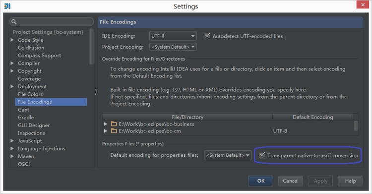

# BC系统开发环境配置


## 一）安装JDK

- 下载绿色版的 JDK７<br>
用 ftp 工具连接到 192.168.0.222（账号reader、密码reader），
文件路径为 /file/tools/java/jdk/jdk1.7.0_21_64.rar<br>
注：也可以到官网下载安装。
- 将 jdk1.7.0_21_64.rar 解压到 D:\GreenSoft\java，确认解压后的目录结构如下：
```
D:\GreenSoft\java\jdk1.7.0_21_64\bin
                                \jre
                                \lib
                                \...
```
- 配置环境变量
```
JAVA_HOME = D:\GreenSoft\java\jdk1.7.0_21_64
PATH 添加 %JAVA_HOME%\bin
```
- 验证安装是否正确
```
> java -version
```

## 二）安装 Maven

- 到 [Maven 官网](http://maven.apache.org/) 下载最新版的 maven 二进制包，如 [apache-maven-3.2.1-bin.tar.gz](http://mirrors.cnnic.cn/apache/maven/maven-3/3.2.1/binaries/apache-maven-3.2.1-bin.tar.gz)。

- 将 apache-maven-3.2.1-bin.tar.gz 解压到 D:\GreenSoft，确认解压后的目录结构为如下：
```
D:\GreenSoft\apache-maven-3.2.1\bin
                               \boot
                               \conf
                               \lib
                               \...
```

- 配置环境变量
```
M2_HOME = D:\GreenSoft\apache-maven-3.2.1
PATH 添加 %M2_HOME%\bin
```

- 增加 Maven 用户配置文件<br>
在用户目录下创建 .m2 目录：
```
> C:
> cd %USERPROFILE%
> md .m2
```
拷贝这里的 [settings.xml](https://raw.githubusercontent.com/bcsoft/bc-start/master/settings.xml) 文件到 .m2 目录下。

- 验证安装是否正确
```
> mvn -v
```

- 参考资料<br>
[Maven开发环境配置](http://rongjih.blog.163.com/blog/static/33574461201041615854740/)<br>
[官方参考文档](http://maven.apache.org/guides/index.html)<br>
[Maven权威指南](http://books.sonatype.com/mvnref-book/reference/index.html)<br>
《Maven权威指南中文版》可到 192.168.0.222 /file/book/Maven权威指南(中文带目录导航).pdf 下载。

## 三）安装 Git 
- [官网下载](http://msysgit.github.io/) 或 `192.168.0.222 /file/tools/git/Git-1.9.2-preview20140411.exe` 下载安装。<br>
注：安装到 "Select Components" 界面时，注意要选择如下安装选项:
  - [x] Windows Explorerintegration
    - [x] Simple context menu (Registry based)
      - [x] Git Bash Here
      - [x] Git GUI Here<br>


- 验证安装是否正确<br>
在资源管理器空白的地方点击鼠标右键，能够看到 Git Bash Here 和 Git GUI Here 两个菜单项就证明安装OK，点击 Git Bash Here 菜单项就可进入 Git 命令行，如下图所示：<br>
<br>


- 参考资料<br>
[首先基于互联网的Git开发环境搭建(Windows系统)](http://rongjih.blog.163.com/blog/static/33574461201101504819691/)<br>
[Git常用操作命令](http://rongjih.blog.163.com/blog/static/335744612010112562833316/)

## 四）配置 ssh key
如果已经有相应的密钥对，可以直接将私钥放到 "%USERPROFILE%/.ssh/" 目录下即可。将公钥发送给管理员，让管理员配置你有权限使用此密钥对检出内网的相关 git 仓库。如果还没有密钥对就按如下步骤创建：
- 打开Git 的命令行窗口，输入`$ ssh-keygen -C "your@email.com" -t rsa`，按提示输入相关信息生成rsa key（注意email地址按你的实际输入）；默认就会在用户目录下创建名为“.ssh”的目录，并在该目录下生成两个文件，`id_rsa.pub` 和 `id_rsa`，一个是公钥(.pub)另一个是私钥。
- 如果想修改上面创建的密钥的密码，执行命令 `$ ssh-keygen -f '/c/Documents and Settings/yourName/.ssh/id_rsa' -p`，根据提示输入原来的密码和设置新的密码即可。

## 五）[可选] 安装 TortoiseGit 
[官网下载](http://tortoisegit.org/) 或 `192.168.0.222 /file/tools/git/TortoiseGit-1.8.8.0-64bit.msi` 下载安装。<br>
汉化：`192.168.0.222 /file/tools/git/TortoiseGit-LanguagePack-1.8.8.0-64bit-zh_CN.msi`<br>
安装成功后你将会在资源管理器的鼠标右键菜单中看到相应的选项，如下图所示：<br>


## 六）安装数据库
系统使用 PostgreSQL 9+ 数据库，下载安装后，创建名为 bcsystem 的开发数据库（拥有者的账号密码也同时设置为 bcsystem），
创建成功后，向管理员所要开发环境使用的数据库备份文件，将其导入到刚创建的 bcsystem 数据库中即可。
- 参考资料：<br>
[官方网站](http://www.postgresql.org)<br>
[PostgreSQL 脚本收集](http://rongjih.blog.163.com/blog/static/33574461201110300454392/)

## 七）检出 bc-system 系统
- 切换到工作目录 E:\Work
```
$ cd E:
$ cd E:\Work
```
- 检出 bc-start
```
$ git clone git@github.com:bcsoft/bc-start.git
```
- 执行初始化脚本
```
$ ./bc-start/start.sh [options]
options 选项说明：
-r  运行系统，即对 bc-system 执行 $ mvn jetty:run -Ppostgresql
-cr 清理后再运行系统，即对 bc-system 执行 $ mvn clean jetty:run -Ppostgresql
-s  检出所有模块的源代码，如 $ ./bc-start/start.sh -s
-i  对检出的模块源代码执行 $ mvn install -Dmaven.test.skip=true
-ci 对检出的模块源代码执行 $ mvn clean install -Dmaven.test.skip=true
-u  更新所有模块的源代码，即对所有模块执行 $ git pull origin master
```
如执行 `./bc-start/start.sh -r` 就会自动使用你上面配置好的私钥检出 bc-system 项目并使用 Maven Jetty 插件直接运行起来，通过 http://127.0.0.1:8082 就可访问系统。<br>
如执行 `./bc-start/start.sh -si` 就会将 bc-system 项目所依赖的全部模块的源代码也同时检出来，并使用 Maven Install 命令自动打包安装好。检出后的源码目录结构参考下图所示：


## 八）安装 Eclipse 开发环境
- 安装 Eclipse<br>
到 `192.168.0.222 /file/tools/java/eclipse/eclipse-jee-juno-SR2-win32-x86_64.zip` 下载绿色版 eclipse，将其解压并重命名到 "D:\GreenSoft\eclipse\eclipse-jee-juno-SR2-win32-x86_64"，其目录结构应该如下：
```
eclipse-jee-juno-SR2-win32-x86_64\configuration
                                 \dropins
                                 \plugins
                                 \eclipse.exe
                                 \...
```
- 安装插件<br>
将 `192.168.0.222 /file/tools/java/eclipse/dropins-juno/*` 下的所有插件下载并解压到上面的 `eclipse-jee-juno-SR2-win32-x86_64\dropins` 目录，解压后的目录结构类似如下：<br>


- 配置工作空间使用UTF-8编码<br>
如下图所示：<br>


- 导入模块<br>
请务必以 Maven 模块的方式导入上面用 Git 检出的相关模块。由于项目模块太多，为了保证 Eclipse 运行快速，请按需只导入需要的模块进行开发。

- 参考资料<br>
[Eclipse 中好用的项目原型设计插件 WireframeSketcher](http://rongjih.blog.163.com/blog/static/33574461201171023649680/)<br>
[Eclipse 中好用的Properties Editor插件(属性文件编辑器)](http://rongjih.blog.163.com/blog/static/335744612011211113352570/)<br>
[Eclipse 编辑技巧收集](http://rongjih.blog.163.com/blog/static/33574461201321815634218/)<br>
[Eclipse 的 Tab 宽度设置](http://rongjih.blog.163.com/blog/static/33574461201362595229871/)

## 九）[可选] 安装 IntelliJ Idea 开发环境<br>
如果你习惯使用 IntelliJ Idea 而不是 Eclipse，按如下步骤安装配置 IntelliJ Idea：
- 安装 IntelliJ Idea 13+<br>
[官网下载](http://www.jetbrains.com/idea/) 或 `192.168.0.222 /file/tools/java/idea/ideaIU-13.1.1.exe` 下载安装。

- 属性文件中文转码设置<br>
Settings->File encoding，选中Transparent native-to-ascii conversion，参考下图：<br>


设置后，默认情况下 IDEA 将属性文件中的 Unicode 编码保存为大写，我们项目要求保存为小写，故需修改 `bin/idea.properties` 文件，增加如下的属性配置：
```
idea.native2ascii.lowercase=true
```

- 参考资料<br>
[IDEA 快捷键收集](http://rongjih.blog.163.com/blog/static/3357446120134793148413/)